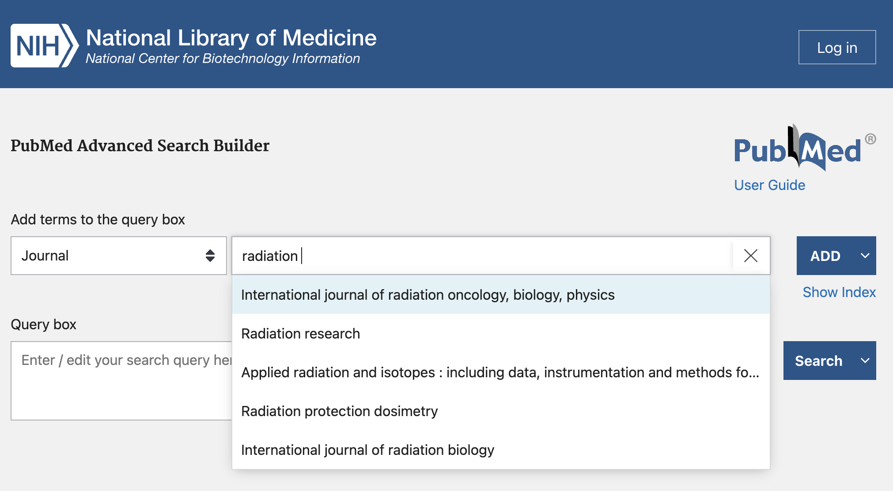
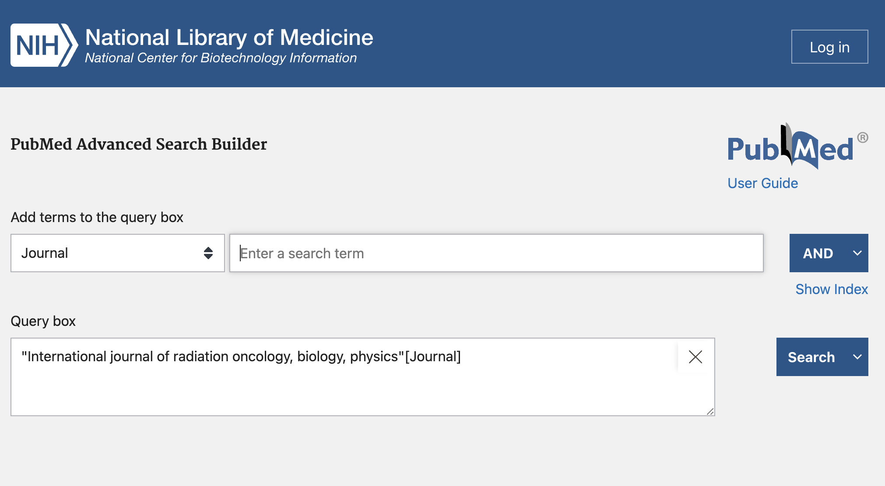
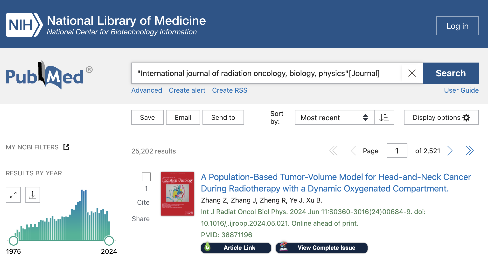
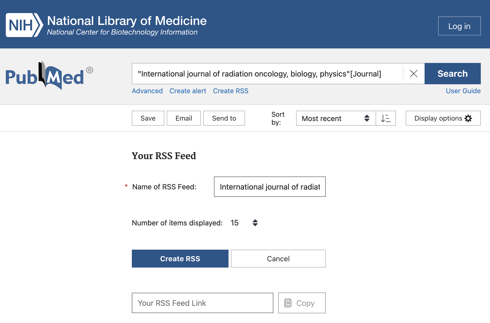
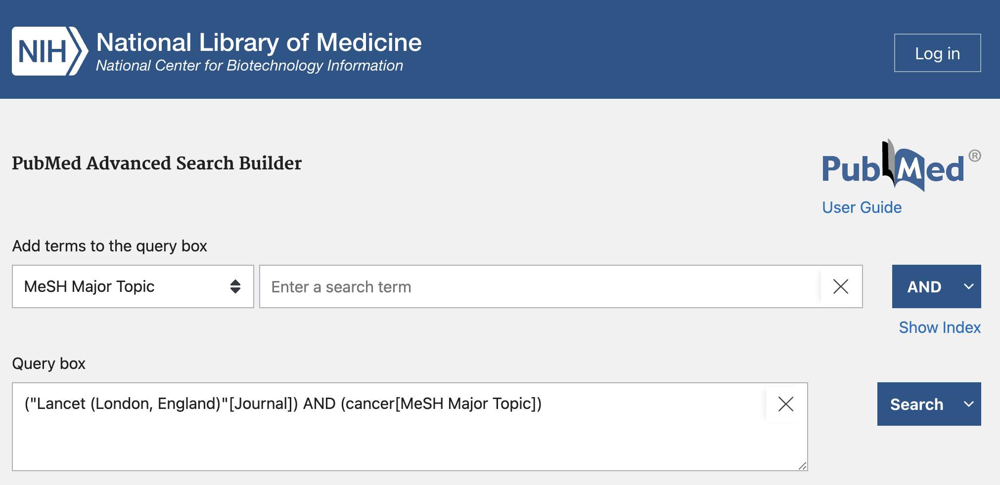
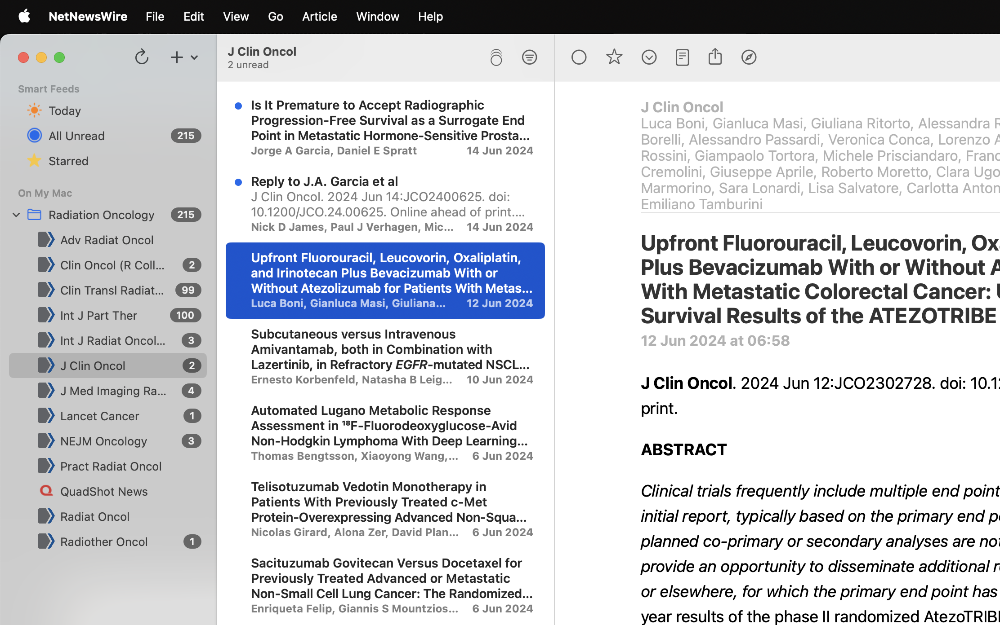

# Keeping up with the Literature

It can be hard to keep up with almost daily changes in clinical practice. Here I outline my current workflow for tracking the evidence.

1. Creating RSS feeds from PubMed
2. Subscribing to the feeds on an RSS reader
3. Selecting articles to read
4. Saving articles to Zotero for reading

## 1. Creating RSS feeds from PubMed
RSS standards for "Really Simple Syndication" and is a service that allows you to subscribe to feeds and be alerted when an update is published.

A really prevalent use of RSS feeds these days is Podcasts. In a podcasting app, the app can keep track of which episodes you've listened to, and show you a list of previous episodes. It also knows to mark as "unlistened" new episodes that come out while you're subscribed to the feed.

In the same way, when you first subscribe to an RSS feed, everything will be "unread", and on subsequent loads, only new articles will be marked as unread... so don't be overwhelmed.

Many academic journals publish an RSS feed, but I've found them to be a bit unreliable and inconsistent. I recently learnt that you can use PubMed to generate RSS feeds from search results.


You can see that when selecting the category to Journal, PubMed recommends the journal title. 




This shows the search results, for all PubMed entries from the Red Journal. Immediately under the search box, the "Create RSS" link is what you want.


You can rename the RSS feed, and select the number of items displayed (I chose 100). Once you click the Create RSS button, PubMed will generate a URL for you to paste into your RSS reader.


Here I created a search team that was a combination of the Lancet journal, and the MeSH Major Topic "cancer". You can generate an RSS feed from ANY search this way.

I did this for The Lancet and for NEJM, as the major papers are published in these larger banner journals.

## 2. Subscribing to the feeds on an RSS reader
Now that you've got an understanding of building RSS feeds from PubMed search queries, you need to use an RSS reader to subscribe to these feeds.

You can [Google](https://www.google.com/search?q=best+RSS+reader+app) what the best RSS reader is.

I'm currently using [Reeder](https://www.reederapp.com/) because I like the UI, but I recommend [NetNewsWire](https://netnewswire.com/) as a free open-source option that has mobile apps.

!!! abstract "My PubMed-generated RSS feeds"
    Advances in Radiation Oncology: 
    ```
    https://pubmed.ncbi.nlm.nih.gov/rss/journals/101677247/?limit=100&amp;name=Adv%20Radiat%20Oncol&amp;utm_campaign=journals
    ```
    Clinical Oncology:
    ```
    https://pubmed.ncbi.nlm.nih.gov/rss/journals/9002902/?limit=100&amp;name=Clin%20Oncol%20%28R%20Coll%20Radiol%29&amp;utm_campaign=journals
    ```
    CTRO: 
    ```
    https://pubmed.ncbi.nlm.nih.gov/rss/journals/101713416/?limit=100&amp;name=Clin%20Transl%20Radiat%20Oncol&amp;utm_campaign=journals
    ```
    Green Journal: 
    ```
    https://pubmed.ncbi.nlm.nih.gov/rss/journals/8407192/?limit=100&amp;name=Radiother%20Oncol&amp;utm_campaign=journals
    ```
    IJPT: 
    ```
    https://pubmed.ncbi.nlm.nih.gov/rss/journals/101674108/?limit=100&amp;name=Int%20J%20Part%20Ther&amp;utm_campaign=journals
    ```
    JCO: 
    ```
    https://pubmed.ncbi.nlm.nih.gov/rss/journals/8309333/?limit=100&amp;name=J%20Clin%20Oncol&amp;utm_campaign=journals
    ```
    JMIRO: 
    ```
    https://pubmed.ncbi.nlm.nih.gov/rss/journals/101469340/?limit=100&amp;name=J%20Med%20Imaging%20Radiat%20Oncol&amp;utm_campaign=journals
    ```
    Lancet Cancer: 
    ```
    https://pubmed.ncbi.nlm.nih.gov/rss/search/1zMxz2uiAqn1qZkCsB7rgeI9q82n4687T9lKlWo88TKDp6wYM9/?limit=100&amp;utm_campaign=pubmed-2&amp;fc=20240612092724
    ```
    NEJM Oncology: 
    ```
    https://pubmed.ncbi.nlm.nih.gov/rss/search/1NGmwZeh8JwZIzqtdCRg1eBm2wNTBszircJk1muY80w5XgRsvV/?limit=100&amp;utm_campaign=pubmed-2&amp;fc=20240612090744
    ```
    PRO: 
    ```
    https://pubmed.ncbi.nlm.nih.gov/rss/journals/101558279/?limit=100&amp;name=Pract%20Radiat%20Oncol&amp;utm_campaign=journals
    ```
    QuadShot News: 
    ```
    http://www.quadshotnews.com/feeds/posts/default?alt=rss
    ```
    Radiation Oncology: 
    ```
    https://pubmed.ncbi.nlm.nih.gov/rss/journals/101265111/?limit=100&amp;name=Radiat%20Oncol&amp;utm_campaign=journals
    ```
    Red Journal: 
    ```
    https://pubmed.ncbi.nlm.nih.gov/rss/journals/7603616/?limit=100&amp;name=Int%20J%20Radiat%20Oncol%20Biol%20Phys&amp;utm_campaign=journals
    ```
    [OPML file](attachments/RadOnc.opml){:download="RadOnc.opml"} <--

You can copy and paste the URLs for each of the Journals above (and QuadShot News), or you can download the OPML file and import that into the RSS reader.

## 3. Selecting articles to read


Above is a screenshot showing the UI for NetNewsWire.

The left-most pane shows the feeds you're subscribed to, the middle pain shows the article titles, and the right-most pane shows the contents of the PubMed page.

From here it's a matter of flicking through the article titles to see what's of interest to you, and reading the abstract within the RSS reader.

## 4. Saving articles to Zotero for reading

Currently the next step in my workflow is to open the link in a browser, and use the [Zotero Connector](https://www.zotero.org/download/connectors) to save the article to my Zotero library.

This currently also requires me to log in to the journals to get the full text PDF, but it hasn't been a huge issue so far.

I prefer to do my reading in Zotero, because if I need to reference the paper then it's already there.

## Wrap-up

I hope this provides a good starting point for ways to keep up to date with the literature. One downside is that this is a PubMed feed, so any articles published to the journals that have not been included in the PubMed database yet won't show up.

In future I'll write about extracting annotations from Zotero and using them in a personal notes system. I'm currently experimenting with [Obsidian](https://obsidian.md/).